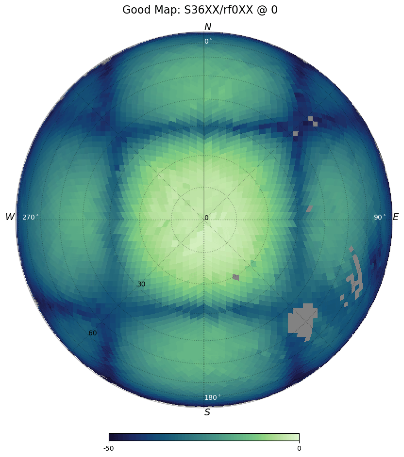
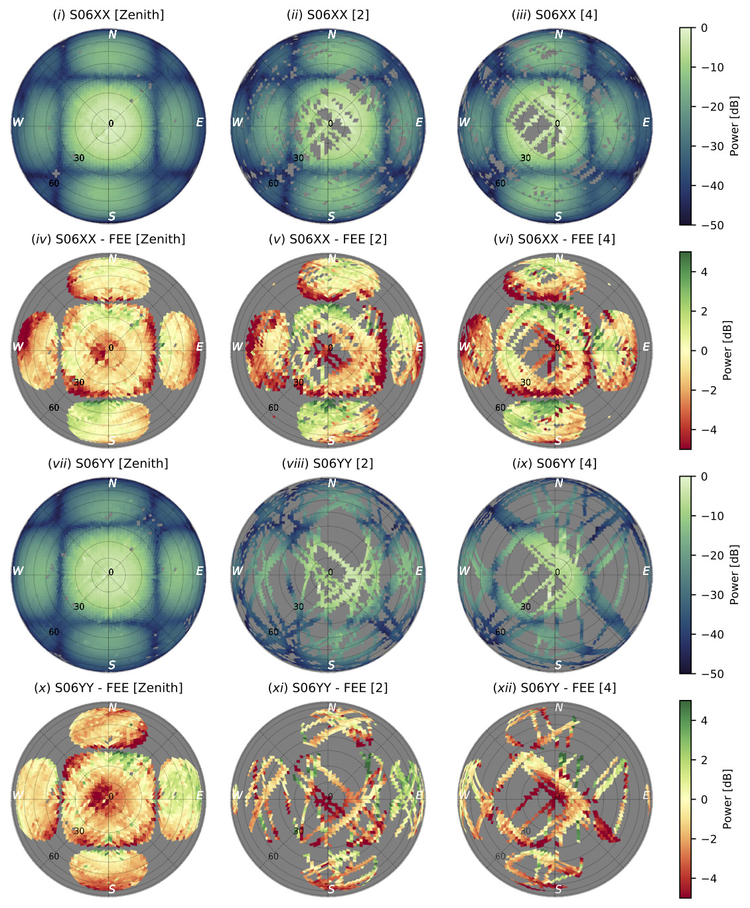
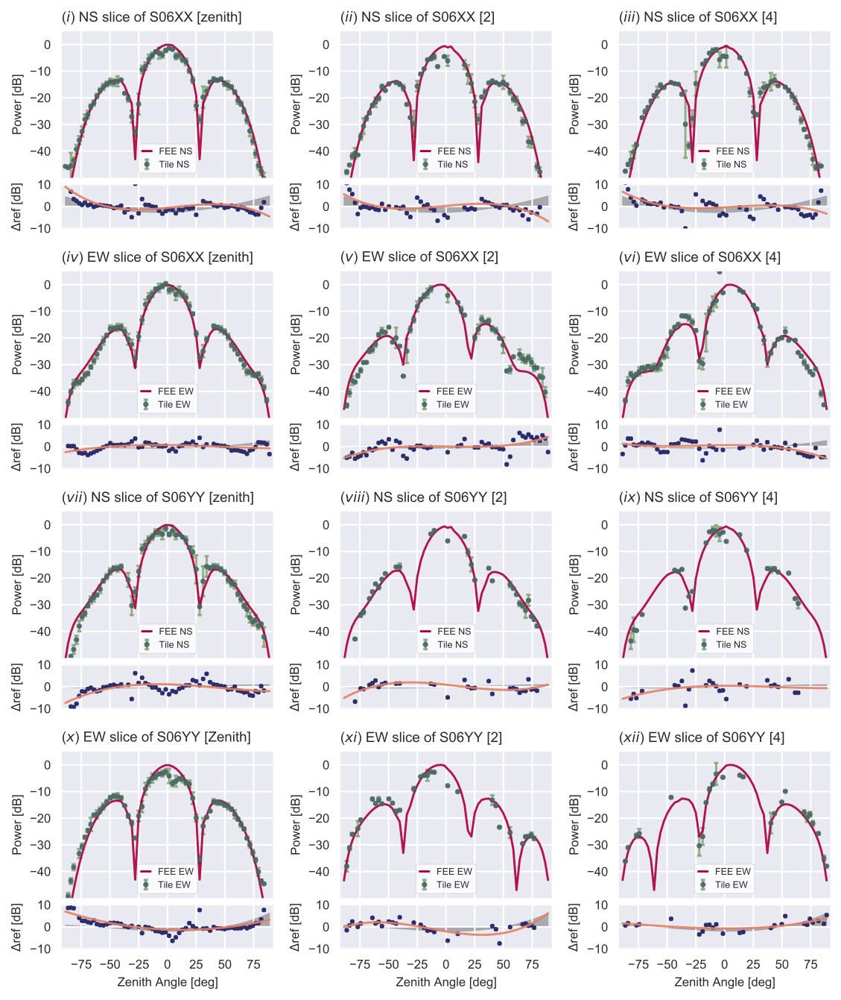

# MWA Satellite Beam Maps

This repository contains a set of MWA Beam maps, measured at 137MHz using communication and weather satellites. These maps were created with data acquired by
Chokshi et al., 2020, using the [EMBERS](https://embers.readthedocs.io) software package.

<p float="left">
  
  
</p>

Download this repository with:

```
git clone https://github.com/amanchokshi/MWA-Satellite-Beam-Maps.git
```

### MWA Maps

All measured MWA beam maps are saved in the `mwa_maps` directory, organised according by reference antenna and telescope pointing number. The beam measurements
are saved as [NumPy Compressed Files](https://numpy.org/doc/stable/reference/generated/numpy.savez_compressed.html) in the form of
[HEALPix](https://healpix.jpl.nasa.gov) maps with `NSIDE=32`.


```
mwa_maps
├── rf0
│   ├── 0
│   ├── 2
│   ├── 4
│   └── 41
└── rf1
    ├── 0
    ├── 2
    ├── 4
    └── 41
```

#### Reading the Beam Maps

The following sample code shows how the beam maps for tile `S06XX` made with the reference antenna `rf0XX` at the zenith [`0`] telescope pointing can be extracted
and visualized.

Install the [EMBERS](https://embers.readthedocs.io) package using instructions at: [https://embers.readthedocs.io/en/latest/installation.html](https://embers.readthedocs.io/en/latest/installation.html)

```
import numpy as np
from matplotlib import pyplot as plt
from embers.rf_tools.colormaps import jade
from embers.tile_maps.beam_utils import plot_healpix

# Path to map file
map_file = "mwa_maps/rf0/0/S06XX_rf0XX_0.npz"

# Extract map data
S06XX = np.load(map_file)["beam_map"]

# Plot healpix map
plot_healpix(data_map=S06XX, title="S06XX_rf0XX", vmin=-50, vmax=0, cmap=jade()[0])

# Save Figure
plt.savefig("S06XX_rf0XX_0.png")
```

### Beam Analysis

The `tile_maps` and `tile_slices` directories part of this repository contain basic analysis of all available beam maps. These plots are identical to
Figure 10, and Figure 12 in Chokshi et al., 2020, repeated for all beam maps.

#### Tile Maps

<p float="left">
  
</p>

#### Tile Slices

<p float="left">
  
</p>
